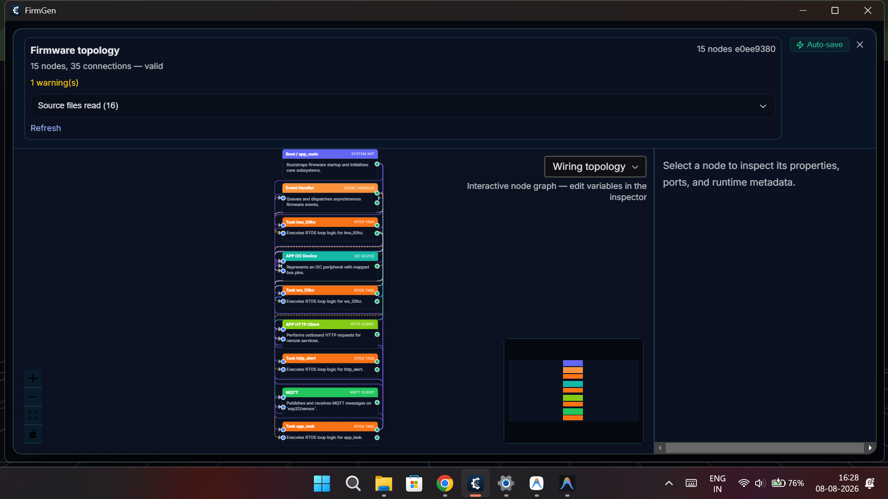

# Aeromesh

Aeromesh is an ESP32-based firmware project designed to detect and monitor severe turbulence using motion tracking data. It leverages an MPU6050 sensor to collect 6-axis motion data (accelerometer and gyroscope) and processes the orientation (roll, pitch, yaw) to monitor environmental conditions. 

## How It Works

The system continuously reads motion data from the MPU6050 via high-speed I2C communication (400kHz). It calculates the roll, pitch, and yaw to detect sudden movements indicative of severe turbulence. 

When a turbulence event occurs, the system uses Wi-Fi to send alerts to a remote HTTP endpoint, utilizing internal cooldown mechanisms to prevent spamming. An onboard RGB LED provides real-time visual status updates to the user.

<<<<<<< HEAD
Additionally, we successfully track the flight device's trajectory and orientation in real-time over WebSockets.
> **Note on Edge AI Integration:** On-device machine learning inference was planned to allow the device to make real-time decisions on its own in bad weather - highly turbulent cases and was also acheieved on the laptop but could not be implemented on the microcontroller due to time constraints and build challenges regarding TensorFlow within the ESP-IDF environment.
=======
Additionally, we successfully track the flight device's trajectory and orientation in real-time over WebSockets. We also successfully run full Edge AI on-device inference using TensorFlow to analyze the motion data directly on the ESP32.
>>>>>>> 93b5730 (full output)

## Features

- **MPU6050 Sensor Integration:** High-speed I2C communication (400kHz) to capture real-time motion data.
- **Wi-Fi Connectivity:** Connects to standard networks to transmit telemetry or alert statuses.
- **HTTP Alert System:** Sends alerts to a remote HTTP endpoint with internal cooldown mechanisms.
- **RGB LED Feedback:** Onboard RGB LED indicator for quick visual status updates.
- **WebSocket Telemetry:** Enables real-time tracking of the flight device's trajectory and orientation.
- **Edge AI Integration:** On-device machine learning inference to analyze motion data using TensorFlow.
- **ESP-IDF Framework:** Built using the official Espressif IoT Development Framework (ESP-IDF) for maximum performance and reliability.

## Hardware Configuration

- **Microcontroller:** ESP32 (or compatible ESP-IDF supported board)
- **Sensor:** MPU6050 (6-axis IMU)
- **Additional:** RGB LED (Optional)

### Default Pin Configuration
| Component | Pin (GPIO) | Notes |
| :--- | :--- | :--- |
| **I2C SDA** | `GPIO 5` | MPU6050 Data |
| **I2C SCL** | `GPIO 4` | MPU6050 Clock |
| **RGB LED** | `GPIO 8` | Status Indicator |

## Project Structure

```text
aeromesh/
├── .gitignore              # Git ignore rules
├── CMakeLists.txt          # Main CMake configuration
├── sdkconfig               # ESP-IDF project configuration
├── aeromesh_media/         # Media files and demonstrations
├── firmware/
│   └── configs/
│       └── app_config.h    # Application-specific configurations (Wi-Fi, Pins, Endpoints)
├── main/                   # Source files and application entry point
```

## Demonstration

### Tasklist Overview


### Firmware Topology


### Hardware Setup


### Videos
- [Video Demonstration 1](./aeromesh_media/VID_20260808_162605257.mp4)
- [Video Demonstration 2](./aeromesh_media/VID_20260808_163537660.mp4)
- [Video Demonstration 3](./aeromesh_media/VID_20260808_173541577.mp4)
